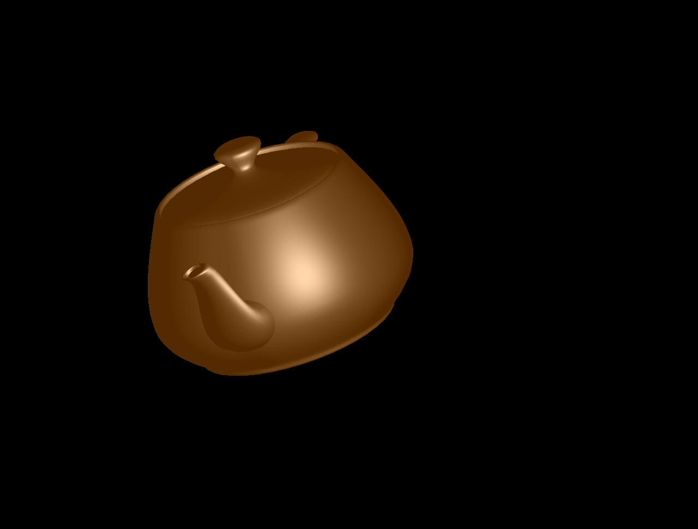

# Computer Graphics Assignment 1

### How to use

Compile the program with `make compile`.

Run the program via
`bin/main <model> <vertex-shader> <fragment-shader> <normal-mode> (texture)`
- *model* is the path to the *obj* file to render
- *vertex-shader* and *fragment-shader* specify paths to the shaders to render
  the scene with; a selection of shaders can be found in the *shaders* directory
- set *normal-mode* to 1 in order to use vertex normals that are averaged over
  face normals or to 0 in order to skip the averaging step
- provide the path to a *bmp* file in the optional *texture* argument in order
  to render the scene with a texture, spherical environment-map or bump-map
  applied to the object

Alternatively, just run the program with the *make* commands described in the
following sections. **This is the recommended way to run the program.**

Exit the program by closing the application window or pressing *escape*.

Properties such as light position, the scene attenuation constants or the
rendered object's color can be changed by modifying *src/scene_constants.h*.

Note that only a single light-source is currently supported, however, supporting
multiple lights is a trivial extension.

### Flat shading
The vertex shader computes and interpolates all intensities: attenuation,
ambient, diffuse and specular. Vertex normals are not averaged over adjacent
faces.

Compile and run with `make flat`

###  Gouraud shading
Same as Flat shading but the vertex normals are computed by averaging over the
normals of adjacent faces.

Compile and run with `make gouraud`

###  Phong shading
The vertex shader computes ambient and diffuse intensities. The fragment shader
computes attenuation and specularities and interpolates everything.

Compile and run with `make phong`

###  Toon shading
The vertex shader computes colors based on material properties. The fragment
shader computes how much light is reflected from each pixel and discretizes the
color into bins accordingly.

Compile and run with `make toon`

###  Depth shading
The vertex shader computes the z-position of each vertex in 3-d space. The
fragment shader Colo's pixels relative to this depth.

Compile and run with `make depth`

###  Texturing
Same as Flat/Gouraud/Phong shading but the fragment shader interpolates pixel
colors with colors from an image.

Compile and run with `make texture-{flat,gouraud,phong}`

###  Bump mapping
Same as Phong shading but the normal vectors are perturbed by a bump-map and the
tangent and binormal vectors before the lighting calculation. The tangent and
binormal vectors are approximated in the vertex shader.

Compile and run with `make bump`

###  Environment mapping
Same as textured Phong shading but the texture is drawn from a spherical map and
mapped onto the object by considering the reflection vector at each pixel rather
than UV coordinates.

Compile and run with `make environment`

###  Camera movement

Use `q w e r t y` to translate in +/- direction around the three axes

Use `a s d f g h` to rotate in +/- direction around the three axes

Press *space* to restore the default perspective.
