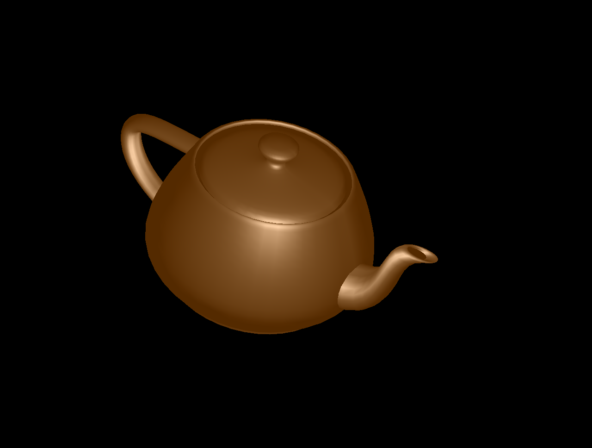

# Compute Graphics Assignment 1

### Flat shading
The vertex shader computes and interpolates all intensities: attenuation,
ambient, diffuse and specular. Vertex normals are not averaged over adjacent
faces.

Compile and run with `make flat`

###  Gouraud shading
The vertex and fragment shaders are the same as for flat shading.  Vertex
normals are computed by averaging over the normals of adjacent faces.

Compile and run with `make gouraud`

###  Phong shading
The vertex shader computes ambient and diffuse intensities. The fragment shader
computes attenuation and specularities and interpolates everything.

Compile and run with `make phong`

###  Toon shading
The vertex shader computes colors based on material properties. The fragment
shader computes how much light is reflected from each pixel and discretizes the
color into bins accordingly.

Compile and run with `make toon`

###  Depth shading
The vertex shader computes the z-position of each vertex in 3-d space. The
fragment shader colors pixels relative to this depth.

Compile and run with `make depth`

###  Texturing
Same as Gouraud shading only that the fragment shader interpolates pixel colors
with colors from an image.

Compile and run with `make texture`

###  Camera movement

Use `q w e r t y` to translate in +/- direction around the three axes

Use `a s d f g h` to rotate in +/- direction around the three axes
